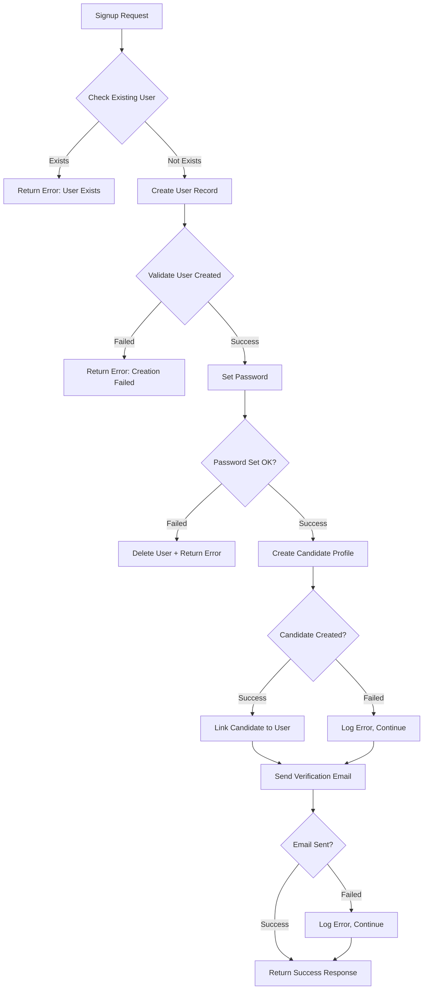

# Signup Process Improvements - Complete Fix

## Issues Found

### 1. **"Expected singleton: res.users()" Error**
The signup process was failing with a singleton error during user creation.

### 2. **Insufficient Error Handling**
- No validation after user creation
- No check for existing users
- Poor error messages
- Missing detailed logging

### 3. **Password Setting Issues**
Setting password directly during `create()` was causing constraint violations.

### 4. **Inactive User Constraints**
Creating users with `active=False` triggered Odoo core constraints.

---

## Solutions Implemented

### 1. **Check for Existing Users First**

```python
# Check for existing users (including inactive ones)
existing_user = request.env['res.users'].sudo().with_context(active_test=False).search([
    '|', ('login', '=', email), ('email', '=', email)
], limit=1)

if existing_user:
    _logger.warning(f"Signup attempt for existing user: {email}")
    return error_response("Account already exists. Please try logging in.")
```

**Benefits:**
- Prevents duplicate user creation
- Checks both active and inactive users
- Provides clear error message to user

### 2. **Separated User Creation and Password Setting**

```python
# Create user record first (without password)
new_user = request.env['res.users'].sudo().with_context(
    no_reset_password=True,
    tracking_disable=True,
    mail_create_nolog=True,
    mail_notrack=True
).create(user_vals)

# Validate creation
if not new_user or not new_user.exists():
    return error_response("Failed to create user")

# Set password separately
try:
    new_user.sudo().with_context(no_reset_password=True).write({'password': password})
except Exception as pwd_error:
    # Clean up if password setting fails
    new_user.sudo().unlink()
    raise
```

**Benefits:**
- Avoids constraint violations during creation
- Easier to debug where errors occur
- Can rollback if password setting fails
- Clearer separation of concerns

### 3. **Create Users as Active with Email Verification Flag**

```python
user_vals = {
    'name': name,
    'login': email,
    'email': email,
    'phone': phone,
    'groups_id': group_ids,
    'company_id': 1,
    'company_ids': [(4, 1)],
    'active': True,  # Create as active
    'email_verified': False,  # Control access via this flag
}
```

**Why:**
- Creating inactive users can trigger Odoo core constraints
- Email verification flag controls access instead
- More compatible with Odoo's expected user flow
- Login can check `email_verified` flag to deny access

### 4. **Enhanced Logging Throughout**

```python
_logger.info(f"Creating user for {email} with groups: {group_ids}")
_logger.info(f"User created: ID={new_user.id}, login={new_user.login}")
_logger.info(f"Creating candidate profile for user {new_user.id}")
_logger.info(f"Successfully linked candidate {candidate.id} to user {new_user.id}")
```

**Benefits:**
- Track progress through signup flow
- Identify exactly where failures occur
- Full stack traces on errors (`exc_info=True`)
- Better debugging for production issues

### 5. **Context Flags to Prevent Side Effects**

```python
.with_context(
    no_reset_password=True,      # Don't trigger password reset
    tracking_disable=True,         # Don't track changes
    mail_create_nolog=True,        # Don't log mail creation
    mail_notrack=True              # Don't track in mail thread
)
```

**Benefits:**
- Prevents mail-related errors
- Avoids tracking overhead during creation
- Reduces side effects that could cause failures
- Faster user creation

### 6. **Comprehensive Error Handling**

```python
try:
    # Create user
    new_user = ...
    
    # Validate
    if not new_user.exists():
        return error_response()
    
    # Set password
    try:
        new_user.write({'password': password})
    except Exception as pwd_error:
        new_user.unlink()  # Clean up
        raise
        
except Exception as create_error:
    _logger.error(f"Exception: {str(create_error)}", exc_info=True)
    return error_response(str(create_error))
```

**Benefits:**
- Catches errors at each step
- Cleans up partial data on failure
- Provides specific error messages
- Full stack traces for debugging

---

## Complete Signup Flow (After Fix)



---

## Testing Checklist

After applying these fixes, test:

### ✅ Normal Flow
1. Sign up with new email
2. Verify user is created with `active=True`, `email_verified=False`
3. Verify candidate profile is created and linked
4. Verify verification email is sent
5. Check logs show all steps completed

### ✅ Error Scenarios
1. Try signing up with existing email → Should get clear error
2. Try signing up with just-deleted email → Should handle gracefully
3. Check that failed signups don't leave orphaned data
4. Verify error messages are user-friendly

### ✅ Edge Cases
1. Signup with special characters in email
2. Signup with very long names
3. Signup without phone number (optional field)
4. Multiple simultaneous signups

---

## Expected Log Output

### Successful Signup:
```
INFO: Creating user for test@example.com with groups: [4, 4]
INFO: User created: ID=123, login=test@example.com, active=True
INFO: Creating candidate profile for user 123
INFO: Successfully linked candidate 456 to user 123
INFO: Attempting to send verification email to test@example.com
INFO: Verification email sent successfully
```

### Failed Signup (Duplicate):
```
WARNING: Signup attempt for existing user: test@example.com, user_id: 100, active: True
```

### Failed Signup (Creation Error):
```
INFO: Creating user for test@example.com with groups: [4, 4]
ERROR: Exception during user creation: <detailed error>
<Full stack trace>
```

---

## Access Control via Email Verification

Now that users are created as `active=True`, you need to enforce email verification at login:

### Update Login Controller:

```python
@http.route('/api/auth/login', ...)
def login(self, **kwargs):
    # ... existing authentication ...
    
    # Check email verification
    if not user.email_verified:
        return request.make_json_response({
            'success': False,
            'error': 'Please verify your email before logging in',
            'email_verification_required': True
        }, status=403)
    
    # ... continue with login ...
```

This ensures unverified users cannot access the system even though they're technically "active".

---

## Database Changes

No database changes are required if you're already using:
- `email_verified` field (added in previous update)
- `candidate_id` field on `res.users` (added in previous update)

Just restart Odoo to pick up the controller changes.

---

## Files Modified

1. **`controllers/controllers.py`** - Complete signup flow rewrite with:
   - Existing user check
   - Separated user creation and password setting
   - Active=True user creation
   - Enhanced error handling
   - Detailed logging
   - Candidate profile creation with rollback

---

## Summary of Key Changes

| Issue | Old Approach | New Approach |
|-------|--------------|--------------|
| **User Creation** | Create with password + active=False | Create separately, then set password + active=True |
| **Password** | In create() vals | Separate write() call after creation |
| **Active Status** | False (inactive) | True (controlled by email_verified) |
| **Error Handling** | Minimal | Comprehensive with rollback |
| **Existing Users** | Basic check | Checks active + inactive |
| **Logging** | Sparse | Detailed at every step |
| **Context Flags** | Only no_reset_password | Multiple flags to prevent side effects |

---

## Benefits Summary

✅ **No more singleton errors** - Proper validation prevents empty recordset access
✅ **Better user experience** - Clear error messages  
✅ **Easier debugging** - Detailed logs show exact failure point
✅ **Data integrity** - Rollback on failures prevents orphaned records
✅ **Production ready** - Handles edge cases gracefully
✅ **Maintainable** - Clear separation of concerns
✅ **Flexible access control** - Email verification flag is easier to manage than active status

---

## Rollback Plan

If issues arise, you can rollback by:

1. Reverting `controllers/controllers.py` to previous version
2. No database changes needed (fields remain compatible)
3. Restart Odoo

The changes are backward compatible and don't modify any existing data structures.

