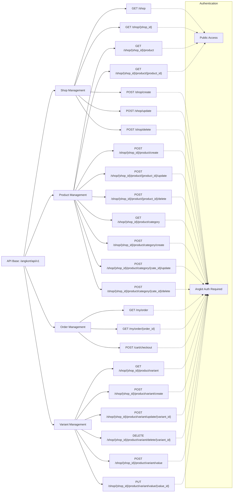

```mermaid
graph LR
    %% Main API Routes
    A[API Base: /angkort/api/v1] --> B[Shop Management]
    A --> C[Product Management]
    A --> D[Order Management]
    A --> E[Variant Management]

    %% Shop Management
    B --> B1[GET /shop]
    B --> B2["GET /shop/{shop_id}"]
    B --> B3[POST /shop/create]
    B --> B4[POST /shop/update]
    B --> B5[POST /shop/delete]

    %% Product Management
    C --> C1["GET /shop/{shop_id}/product"]
    C --> C2["GET /shop/{shop_id}/product/{product_id}"]
    C --> C3["POST /shop/{shop_id}/product/create"]
    C --> C4["POST /shop/{shop_id}/product/{product_id}/update"]
    C --> C5["POST /shop/{shop_id}/product/{product_id}/delete"]

    %% Category Management
    C --> C6["GET /shop/{shop_id}/product/category"]
    C --> C7["POST /shop/{shop_id}/product/category/create"]
    C --> C8["POST /shop/{shop_id}/product/category/{cate_id}/update"]
    C --> C9["POST /shop/{shop_id}/product/category/{cate_id}/delete"]

    %% Order Management
    D --> D1[GET /my/order]
    D --> D2["GET /my/order/{order_id}"]
    D --> D3[POST /cart/checkout]

    %% Variant Management
    E --> E1["GET /shop/{shop_id}/product/variant"]
    E --> E2["POST /shop/{shop_id}/product/variant/create"]
    E --> E3["POST /shop/{shop_id}/product/variant/update/{variant_id}"]
    E --> E4["DELETE /shop/{shop_id}/product/variant/delete/{variant_id}"]
    E --> E5["POST /shop/{shop_id}/product/variant/value"]
    E --> E6["PUT /shop/{shop_id}/product/variant/value/{value_id}"]

    %% Authentication
    subgraph Authentication
        Auth1[Public Access]
        Auth2[Angkit Auth Required]
    end


    %% Apply Styles
    class Auth1 public
    class Auth2 auth
    class B1,B2,C1,C2 endpoint
    class B3,B4,B5,C3,C4,C5,C6,C7,C8,C9,D1,D2,D3,E1,E2,E3,E4,E5,E6 auth

    %% Add Authentication Notes
    B1 -.-> Auth1
    B2 -.-> Auth1
    C1 -.-> Auth1
    C2 -.-> Auth1
    B3 -.-> Auth2
    B4 -.-> Auth2
    B5 -.-> Auth2
    C3 -.-> Auth2
    C4 -.-> Auth2
    C5 -.-> Auth2
    C6 -.-> Auth2
    C7 -.-> Auth2
    C8 -.-> Auth2
    C9 -.-> Auth2
    D1 -.-> Auth2
    D2 -.-> Auth2
    D3 -.-> Auth2
    E1 -.-> Auth2
    E2 -.-> Auth2
    E3 -.-> Auth2
    E4 -.-> Auth2
    E5 -.-> Auth2
    E6 -.-> Auth2
``` 